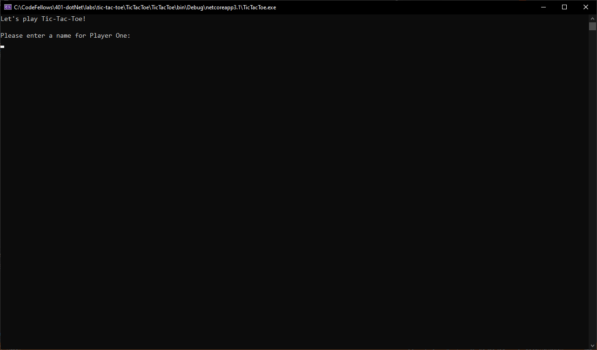
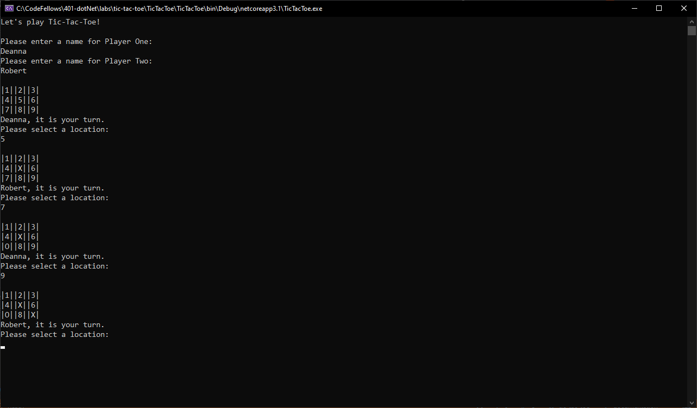
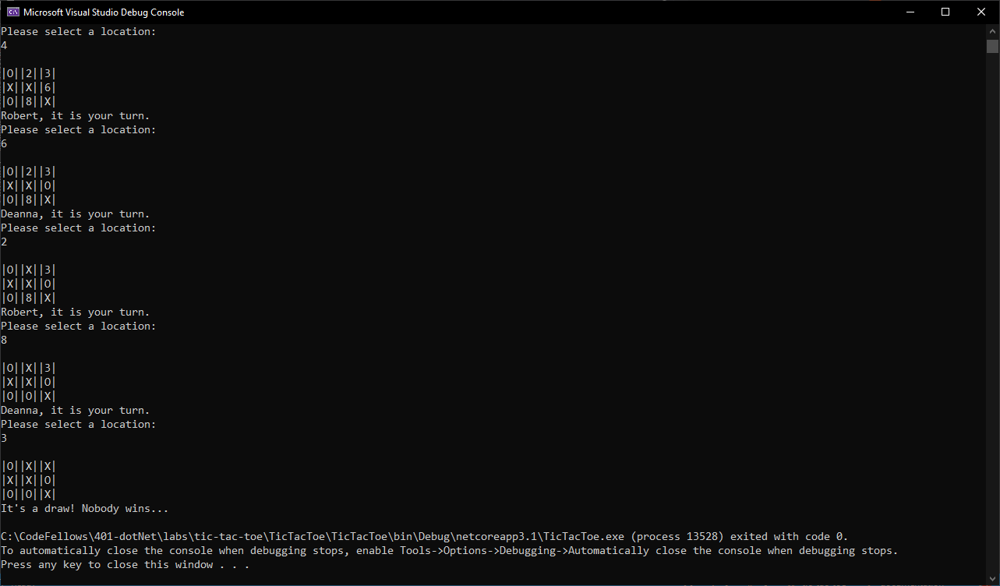

# TicTacToe

Code Fellows 401 .NET Course - Lab: 04 TicTacToe  
_Author: [Robert James Nielsen](https://github.com/robertjnielsen)_

## Overview

TicTacToe is a C# Tic-Tac-Toe game. When first run, the application will ask for the names of two users. The users will then take turns choosing to "mark" locations on the game board. A user can win by marking three locations in a series, either horizontally, vertically, or diagonally. If all nine spaces on the board are marked and no winner is declared, the game will be considered a tie.

## Getting Started

#### Clone This Repository

To clone this repo, enter the following in your command prompt:

`$ git clone https://github.com/robertjnielsen/cf-dotnet-tic-tac-toe.git`

#### Run This Program With Visual Studio

Select `File` -> `Open` -> `Project / Solution`

Navigate to the location where you cloned the repository.

Double-click on the `TicTacToe` directory.

Select and open `TicTacToe.sln`

## Visuals

##### Application Start

##### Application Running

##### Application Complete

## Change Log

**1.5** - 20200321
- Updated documentation, to include:
  - Summary comments for all methods.
  - README.md
- Added screen captures of application.

**1.4** - 20200321
- Fixed bug where users are not prompted to enter a new position on the board to mark, if their initial choice is already marked.

**1.3** - 20200321
- Game is functional and "complete".
- All tests passed.

**1.2** - 20200321
- Created new Xunit project in the solution.
- Started TDD while completing starter code TODOs.

**1.1** - 20200321
- Starting a new game now instantiates two new Player objects.

**1.0** - 20200321
- Utilized assignment starter code.
- Repository initiaized, projects / solutions created.